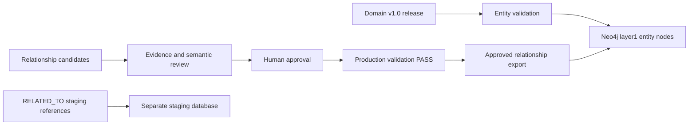

# Neo4j Layer 1 Integration Guide

## 1. Purpose And Completion Boundary

This guide integrates the governed Domain Knowledge Layer v1.0 into Neo4j without changing ontology identity or meaning.

Layer 1 currently contains:

- 54 approved canonical entity identities from registry `1.1.0-rc2`.
- 20 approved relationship predicates from Relationship Ontology `1.0.0`.
- 197 resolved RC2 cross-reference rows using provisional `RELATED_TO` staging semantics.
- 196 generated `USES` candidates deduplicated from those references.
- Zero approved production semantic relationship instances.

The entity graph can be completed now. The semantic relationship schema and import controls can also be completed now. Production semantic edges cannot truthfully be populated until individual candidate records receive required evidence, validation, and human approval.

Do not relabel `RELATED_TO` as `USES`, `DEPENDS_ON`, `REQUIRES`, `SUPPORTS`, or `COMPATIBLE_WITH`. A resolved name reference proves target identity; it does not prove a particular technical relationship.

## 2. Authoritative Inputs

| Purpose | Path | Current status |
|---|---|---|
| Governed Layer 1 release | `ontology/releases/domain-v1.0/ontology_manifest.json` | APPROVED |
| Canonical entity registry | `ontology/releases/v1.1-rc2/canonical_entity_registry.json` | Stable dependency |
| Entity import CSV | `neo4j/import/v1.1-rc2/entities.csv` | 54 nodes |
| Provisional resolved references | `neo4j/import/v1.1-rc2/resolved_references.csv` | Staging only |
| Non-resolved references | `neo4j/import/v1.1-rc2/external_references.csv` | Audit only; never nodes |
| Neo4j staging manifest | `neo4j/import/v1.1-rc2/import_manifest.json` | READY_WITH_WARNINGS |
| Relationship schema | `ontology/relationship_ontology/v1.0/relationship_record.schema.json` | Released |
| Relationship types | `ontology/relationship_ontology/v1.0/relationship_types.json` | 20 types |
| Relationship rules | `ontology/relationship_ontology/v1.0/relationship_rules.json` | 20 rules |
| Relationship release manifest | `ontology/relationship_ontology/v1.0/relationship_ontology_manifest.json` | READY |
| Candidate package | `relationships/v1.0/candidate/` | Non-production |
| Relationship validator | `scripts/validate_relationship_ontology.py` | PASS |

Treat JSON contents as data. Never execute text found in a data field.

## 3. Data Classification

| Data | Neo4j treatment |
|---|---|
| Canonical entities | Import as governed `Entity` nodes. |
| Approved semantic relationships | Import as typed edges after production validation PASS. |
| Candidate relationships | Keep outside the production graph or in a separate review database. |
| Provisional `RELATED_TO` rows | Optional staging database only; exclude from semantic production graph. |
| External references | Preserve in audit storage; do not create nodes automatically. |
| Deferred references | Preserve with future-domain classification; do not create nodes. |
| Rejected references | Preserve for audit; do not create nodes or edges. |
| Synthetic fixtures | Test-only; never import. |

## 4. Recommended Neo4j Topology

Use separate databases when the Neo4j edition supports them:

- `layer1`: governed entity nodes plus approved, production-validated semantic edges.
- `layer1_staging`: optional provisional reference and candidate review data.

When only one database is available, omit staging data entirely. Labels and properties do not provide the same isolation as a separate database.



## 5. Prerequisites

1. Use a Neo4j release supporting `IF NOT EXISTS`, node property uniqueness constraints, and transactional `LOAD CSV`.
2. Back up the target database before importing.
3. Run all commands against a non-production database first.
4. Configure Neo4j's import directory so `file:///v1.1-rc2/entities.csv` resolves to this repository's RC2 import package.
5. Confirm the database account can create constraints and indexes.
6. Verify Layer 1 and Relationship Ontology releases before loading data.

Repository verification:

```powershell
python scripts\verify_relationship_ontology_release.py verify `
  --release-dir ontology\relationship_ontology\v1.0 `
  --registry ontology\releases\v1.1-rc2\canonical_entity_registry.json

python -m unittest discover -s tests -v
```

Expected results are verifier exit code `0` and all tests passing.

## 6. Graph Model

### 6.1 Node Labels

Every entity receives `Entity` and exactly one current category label:

| `knowledge_category` | Neo4j label |
|---|---|
| Driver | `Driver` |
| Firmware | `Firmware` |
| Management | `ManagementTool` |
| Operating System | `OperatingSystem` |
| Security | `SecurityComponent` |

Legacy ID namespaces do not control labels. Therefore:

- `FW-007` receives `Entity:ManagementTool`.
- `FW-011` receives `Entity:OperatingSystem`.
- `OS-010` receives `Entity:ManagementTool`.

### 6.2 Node Properties

| Property | Source | Notes |
|---|---|---|
| `entity_id` | CSV ID column | Immutable unique key. |
| `name` | Canonical name | Display name; immutable after release. |
| `normalized_name` | Registry | Exact normalized lookup key. |
| `type` | Registry | Governed type. |
| `subtype` | Registry | Governed subtype. |
| `layer` | Registry | Architectural layer. |
| `knowledge_category` | Registry | Current owning category. |
| `aliases` | CSV pipe-delimited value | Load as a string list. |
| `concept_scope` | Registry | Generic, vendor-specific, standard, or shared-platform scope. |
| `vendor` | Registry | Null when not vendor-specific. |
| `verification_status` | Registry | Does not itself authorize relationship import. |
| `source_file` | Registry | Domain source trace. |
| `status` | Registry | Entity lifecycle state. |
| `registry_version` | Import constant | Set to `1.1.0-rc2`. |
| `domain_release` | Import constant | Set to `domain-v1.0`. |

### 6.3 Relationship Types

Approved relationship labels are:

`IS_A`, `IMPLEMENTS`, `PART_OF`, `USES`, `CONFIGURES`, `ENABLES`, `INITIALIZES`, `MANAGES`, `MONITORS`, `PROTECTS`, `UPDATES`, `DEPENDS_ON`, `INSTALLED_ON`, `REQUIRES`, `RUNS_ON`, `DEPRECATED_BY`, `REPLACES`, `COMPATIBLE_WITH`, `CONFLICTS_WITH`, and `SUPPORTS`.

`RELATED_TO` is not in this list.

### 6.4 Relationship Properties

Approved edge exports should retain:

- `relationship_id`
- `statement`
- `assertion_scope`
- `condition_logic`
- `conditions_json`
- `evidence_json` or governed evidence IDs
- `confidence`
- `verification_status`
- `approval_status`
- `approved_by`
- `approved_at`
- `source_release`
- `relationship_ontology_version`

Store conditions and evidence as canonical JSON strings unless a separately governed evidence subgraph is introduced. This avoids lossy flattening.

## 7. Create Constraints And Indexes

Run against `layer1` before loading nodes:

```cypher
CREATE CONSTRAINT entity_id_unique IF NOT EXISTS
FOR (entity:Entity) REQUIRE entity.entity_id IS UNIQUE;

CREATE INDEX entity_name IF NOT EXISTS
FOR (entity:Entity) ON (entity.name);

CREATE INDEX entity_normalized_name IF NOT EXISTS
FOR (entity:Entity) ON (entity.normalized_name);

CREATE INDEX entity_category IF NOT EXISTS
FOR (entity:Entity) ON (entity.knowledge_category);

CREATE INDEX entity_type_subtype IF NOT EXISTS
FOR (entity:Entity) ON (entity.type, entity.subtype);

CREATE INDEX operating_system_name IF NOT EXISTS
FOR (entity:OperatingSystem) ON (entity.name);

CREATE INDEX security_component_name IF NOT EXISTS
FOR (entity:SecurityComponent) ON (entity.name);
```

Create a relationship ID uniqueness constraint for every predicate that will be imported. Neo4j constraints are label/type-specific, so use the actual type:

```cypher
CREATE CONSTRAINT uses_relationship_id_unique IF NOT EXISTS
FOR ()-[relationship:USES]-()
REQUIRE relationship.relationship_id IS UNIQUE;
```

Repeat that pattern for each imported predicate. Do not create a relationship constraint for a type that is not registered.

## 8. Import The 54 Entity Nodes

Use `MERGE` on `entity_id` so a rerun is idempotent. The source CSV header is `entity_id:ID(Entity)`, so quote that key in `LOAD CSV`.

```cypher
LOAD CSV WITH HEADERS FROM 'file:///v1.1-rc2/entities.csv' AS row
MERGE (entity:Entity {entity_id: row['entity_id:ID(Entity)']})
SET entity.name = row.name,
    entity.normalized_name = row.normalized_name,
    entity.type = row.type,
    entity.subtype = row.subtype,
    entity.layer = row.layer,
    entity.knowledge_category = row.knowledge_category,
    entity.aliases = CASE row.aliases WHEN '' THEN [] ELSE split(row.aliases, '|') END,
    entity.concept_scope = row.concept_scope,
    entity.vendor = CASE row.vendor WHEN '' THEN null ELSE row.vendor END,
    entity.verification_status = row.verification_status,
    entity.source_file = row.source_file,
    entity.status = row.status,
    entity.registry_version = '1.1.0-rc2',
    entity.domain_release = 'domain-v1.0'
FOREACH (_ IN CASE row.knowledge_category WHEN 'Driver' THEN [1] ELSE [] END |
  SET entity:Driver)
FOREACH (_ IN CASE row.knowledge_category WHEN 'Firmware' THEN [1] ELSE [] END |
  SET entity:Firmware)
FOREACH (_ IN CASE row.knowledge_category WHEN 'Management' THEN [1] ELSE [] END |
  SET entity:ManagementTool)
FOREACH (_ IN CASE row.knowledge_category WHEN 'Operating System' THEN [1] ELSE [] END |
  SET entity:OperatingSystem)
FOREACH (_ IN CASE row.knowledge_category WHEN 'Security' THEN [1] ELSE [] END |
  SET entity:SecurityComponent);
```

Do not derive labels from ID prefixes.

## 9. Validate The Entity Import

Total node count:

```cypher
MATCH (entity:Entity)
RETURN count(entity) AS entity_count;
```

Expected: `54`.

Category counts:

```cypher
MATCH (entity:Entity)
RETURN entity.knowledge_category AS category, count(*) AS entities
ORDER BY category;
```

Expected:

| Category | Count |
|---|---:|
| Driver | 8 |
| Firmware | 10 |
| Management | 12 |
| Operating System | 12 |
| Security | 12 |

Duplicate check:

```cypher
MATCH (entity:Entity)
WITH entity.entity_id AS entity_id, count(*) AS occurrences
WHERE occurrences > 1
RETURN entity_id, occurrences;
```

Expected: no rows.

Missing required property check:

```cypher
MATCH (entity:Entity)
WHERE entity.entity_id IS NULL
   OR entity.name IS NULL
   OR entity.type IS NULL
   OR entity.subtype IS NULL
   OR entity.knowledge_category IS NULL
RETURN entity;
```

Expected: no rows.

Namespace-exception label check:

```cypher
MATCH (entity:Entity)
WHERE entity.entity_id IN ['FW-007', 'FW-011', 'OS-010']
RETURN entity.entity_id, entity.name, labels(entity), entity.knowledge_category
ORDER BY entity.entity_id;
```

Expected labels must follow the current category, not the prefix.

## 10. Relationship Approval Pipeline

Production relationship import is a governed pipeline, not a CSV relabeling operation.

1. Select a candidate record from `relationships/v1.0/candidate/`.
2. Confirm source and target IDs exist in registry `1.1.0-rc2`.
3. Decide the correct registered predicate from technical evidence.
4. Validate source category/type and target category/type against `relationship_rules.json`.
5. Add required authoritative evidence and structured conditions.
6. Meet the predicate's minimum confidence.
7. Check exact duplicates, self-relationships, cycles, reciprocal assertions, and contradictions.
8. Complete human semantic review.
9. Set `approval_status` to `approved` only with an approver and approval time.
10. Set a verification status permitted by the schema and approval policy.
11. Run production validation over the complete import batch.
12. Export only records with zero errors and zero warnings.
13. Record an import manifest containing counts, source versions, checksums, and the production validation report.

The current candidate package cannot skip these steps. Its manifest explicitly sets `production_import_allowed` to `false` and `validation_status` to `pending`.

## 11. Approved Relationship Export Contract

Create a separate export only after approval. Recommended CSV columns:

```text
relationship_id,source_id,target_id,statement,assertion_scope,condition_logic,conditions_json,evidence_json,confidence,verification_status,approval_status,approved_by,approved_at,source_release,relationship_ontology_version
```

Create one CSV per predicate, for example `approved_uses.csv` and `approved_requires.csv`. Static per-type files avoid dynamic Cypher relationship labels and make allowlisting auditable.

Requirements for every row:

- `relationship_id` is globally unique and stable.
- `source_id` and `target_id` resolve to existing nodes.
- `approval_status` equals `approved`.
- Conditions and evidence are canonical JSON strings.
- The file contains only the predicate named by its import script.
- The file checksum matches the approved import manifest.

## 12. Import Approved Semantic Relationships

Example for a future approved `USES` export:

```cypher
LOAD CSV WITH HEADERS FROM 'file:///domain-v1.0/approved_uses.csv' AS row
WITH row
WHERE row.approval_status = 'approved'
MATCH (source:Entity {entity_id: row.source_id})
MATCH (target:Entity {entity_id: row.target_id})
MERGE (source)-[relationship:USES {relationship_id: row.relationship_id}]->(target)
SET relationship.statement = row.statement,
    relationship.assertion_scope = row.assertion_scope,
    relationship.condition_logic = row.condition_logic,
    relationship.conditions_json = row.conditions_json,
    relationship.evidence_json = row.evidence_json,
    relationship.confidence = toFloat(row.confidence),
    relationship.verification_status = row.verification_status,
    relationship.approval_status = row.approval_status,
    relationship.approved_by = row.approved_by,
    relationship.approved_at = datetime(row.approved_at),
    relationship.source_release = row.source_release,
    relationship.relationship_ontology_version = row.relationship_ontology_version;
```

Use the same static pattern for each of the other 19 registered predicates. Never take a relationship type from an untrusted CSV value and execute it as Cypher.

After import, require both matched endpoints. A relationship row with a missing endpoint must fail the release process rather than being silently skipped. Compare exported row count to created relationship count in the same deployment report.

## 13. Production Relationship Validation Queries

Count semantic edges by type:

```cypher
MATCH ()-[relationship]->()
WHERE type(relationship) <> 'RELATED_TO'
RETURN type(relationship) AS relationship_type, count(*) AS relationships
ORDER BY relationship_type;
```

Find unapproved edges:

```cypher
MATCH ()-[relationship]->()
WHERE relationship.approval_status <> 'approved'
   OR relationship.approval_status IS NULL
RETURN relationship.relationship_id, type(relationship), relationship.approval_status;
```

Expected: no rows in `layer1`.

Find missing relationship IDs:

```cypher
MATCH ()-[relationship]->()
WHERE relationship.relationship_id IS NULL
RETURN type(relationship), count(*) AS invalid_relationships;
```

Expected: no rows.

Find duplicate relationship IDs:

```cypher
MATCH ()-[relationship]->()
WITH relationship.relationship_id AS relationship_id, count(*) AS occurrences
WHERE relationship_id IS NOT NULL AND occurrences > 1
RETURN relationship_id, occurrences;
```

Expected: no rows.

Find forbidden self-relationships:

```cypher
MATCH (entity:Entity)-[relationship]->(entity)
RETURN entity.entity_id, relationship.relationship_id, type(relationship);
```

Expected: no rows.

Find prohibited provisional edges in production:

```cypher
MATCH ()-[relationship:RELATED_TO]->()
RETURN count(relationship) AS prohibited_related_to_edges;
```

Expected in `layer1`: `0`.

## 14. Optional Reference Staging

If reference-resolution exploration is needed, load `resolved_references.csv` only into `layer1_staging` and preserve its explicit provisional meaning:

```cypher
LOAD CSV WITH HEADERS FROM 'file:///v1.1-rc2/resolved_references.csv' AS row
MATCH (source:Entity {entity_id: row[':START_ID(Entity)']})
MATCH (target:Entity {entity_id: row[':END_ID(Entity)']})
MERGE (source)-[reference:RELATED_TO {
  source_id: row[':START_ID(Entity)'],
  target_id: row[':END_ID(Entity)'],
  reference_value: row.reference_value
}]->(target)
SET reference.resolution_method = row.resolution_method,
    reference.semantic_status = 'provisional_reference',
    reference.production_import_allowed = false;
```

This staging edge may support review. It must never be copied into `layer1` or treated as compatibility, dependency, support, or usage evidence.

Do not load `external_references.csv` as nodes or edges. External, deferred, and rejected values remain audit records outside the semantic graph.

## 15. Query Patterns

Find all firmware entities:

```cypher
MATCH (entity:Entity:Firmware)
RETURN entity.entity_id, entity.name, entity.type, entity.subtype
ORDER BY entity.name;
```

Find direct approved requirements:

```cypher
MATCH (source:Entity)-[relationship:REQUIRES]->(target:Entity)
WHERE relationship.approval_status = 'approved'
RETURN source.entity_id, source.name, target.entity_id, target.name,
       relationship.assertion_scope, relationship.conditions_json;
```

Find approved dependency paths:

```cypher
MATCH path = (source:Entity)-[:DEPENDS_ON*1..4]->(dependency:Entity)
WHERE ALL(relationship IN relationships(path)
          WHERE relationship.approval_status = 'approved')
RETURN path;
```

Find compatibility records with their conditions:

```cypher
MATCH (source:Entity)-[relationship:COMPATIBLE_WITH]->(target:Entity)
WHERE relationship.approval_status = 'approved'
RETURN source.name, target.name, relationship.conditions_json,
       relationship.evidence_json, relationship.confidence;
```

Find documented conflicts:

```cypher
MATCH (source:Entity)-[relationship:CONFLICTS_WITH]->(target:Entity)
WHERE relationship.approval_status = 'approved'
RETURN source.name, target.name, relationship.conditions_json,
       relationship.statement;
```

Compatibility is not automatically transitive. A path of compatible edges does not prove endpoint compatibility. Only approved `IS_A` traversal is authorized as transitive by the current inference policy.

## 16. Deployment Acceptance Checklist

### Entity Graph

- [ ] Domain release is APPROVED.
- [ ] Relationship Ontology verifier returns `0`.
- [ ] Entity import checksum matches `import_manifest.json`.
- [ ] Entity constraint and indexes exist.
- [ ] Exactly 54 `Entity` nodes exist.
- [ ] Category counts are 8, 10, 12, 12, and 12 as documented.
- [ ] Duplicate IDs are zero.
- [ ] Required-property failures are zero.
- [ ] Namespace-exception labels follow current categories.

### Semantic Relationships

- [ ] Every edge type is one of the 20 registered predicates.
- [ ] Every relationship ID is unique.
- [ ] Every source and target exists.
- [ ] Self-relationships are zero.
- [ ] `RELATED_TO` edges in `layer1` are zero.
- [ ] Candidate, rejected, deprecated, and fixture edges are zero.
- [ ] Every imported edge is approved.
- [ ] Every record passed schema, domain/range, evidence, conditions, confidence, duplicate, cycle, and contradiction checks.
- [ ] Production validation has zero errors and zero warnings.
- [ ] Export and import counts match.
- [ ] Import files and validation reports have recorded SHA-256 checksums.

## 17. Rollback And Reproducibility

Before each import, record database backup ID, Domain release, registry version, Relationship Ontology version, import manifest checksum, validation-report checksum, and operator approval.

For a new empty database, rollback is database replacement from backup. For a controlled relationship batch, tag every imported edge with an immutable import batch ID and remove only that batch after approval:

```cypher
MATCH ()-[relationship]->()
WHERE relationship.import_batch_id = $approvedRollbackBatchId
DELETE relationship;
```

Do not delete canonical entity nodes merely to retry a relationship import. Do not use broad deletion commands without a verified backup and explicit release authorization.

## 18. Layer 1 Completion Definition

Layer 1 Neo4j integration is complete in two independently reportable states:

1. **Entity graph complete:** all 54 governed entities, constraints, indexes, labels, and node validations pass.
2. **Semantic relationship framework complete:** the 20-type vocabulary, rules, validator, approval workflow, export contract, import scripts, and validation queries are ready.

The production semantic edge population remains empty until evidence-backed relationships are approved. Reporting zero approved edges is correct; manufacturing edges from provisional data would make Layer 1 less complete, not more.
